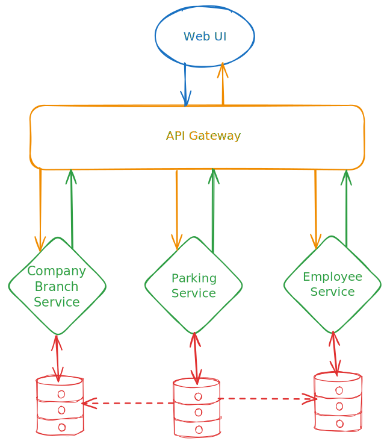

# Задание

Вдохновлено *архитектурным ката*, только для системного дизайна.

## Описание

Компания *X* занимается деятельностью *Y* и имеет:

- 3 филиала;
- BI-систему для внутреннего использования;
- автопарк из 300 автомобилей;
- одну парковку на филиал.

## Пользователи

В одном филиале в среднем 100 сотрудников.

## Требования

В компании хотят добавить модуль для работы с автопарком и начать со следующего функционала:

- просмотр автомобилей;
- фильтрация автомобилей;
- поиск автомобилей;
- сортировка автомобилей.

Автомобиль должен отображать следующую информацию:

- марка автомобиля;
- модель автомобиля;
- класс автомобиля;
- владелец автомобиля (название филиала);
- водитель автомобиля (ФИО) - если есть;
- адрес парковки (на которой находится автомобиль).

## UI/UX

В новом модуле ожидается отображение таблицы с автомобилями,
в которой есть сортировка и пагинация,
а также форма с компонентами для фильтрации.

## Архитектура

Текущая архитектура BI-системы имеет следующий вид:

- Web UI - для работы пользователей.
- API Gateway - для маршрутизации внешних вызовов во внутренние.
- Employee Service - для работы с данными сотрудников.
- Company Branch Service - для работы с данными филиалов.
- Parking Service - для работы с данными автопарка.

В базе данных Parking Service автомобиль имеет внешние ссылки (идентификаторы) на владельца и водителя.

## Дополнительный контекст

В компании ходят разные слухи,
одни говорят,
что на рынке проблемы с деятельностью *Y* и компанию ждет крах,
другие же говорят,
что компания планирует открыть еще пару филиалов и этим объясняется недавняя смена офиса одним из филиалов.
